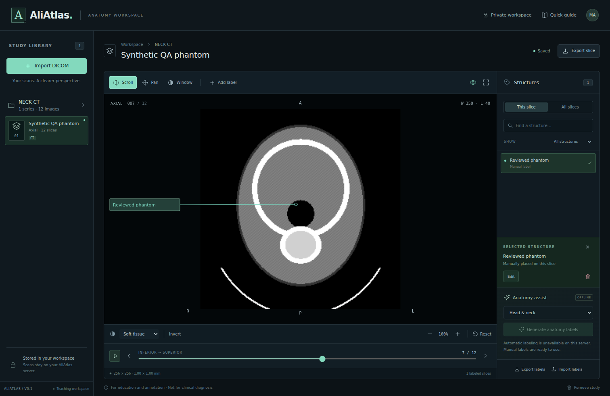

# AliAtlas

A CT anatomy workspace built with **Next.js, React, and a JavaScript/Node.js backend**, inspired by the supplied axial head/neck atlas references.

Sign in, upload a DICOM series (archived in [Orthanc](https://www.orthanc-server.com/)), select a stack, scroll through its slices, and place anatomical labels that remain attached to the correct image coordinates. An optional Node worker runs a real segmentation model and creates slice-specific labels from its output.



The preview uses a generated software-test phantom, not a patient scan or an anatomical reference.

## Start locally

Use Node.js 22 or newer:

```bash
npm ci
cp .env.example .env.local
docker compose up -d postgres orthanc
npm run dev
```

Open [localhost:3000](http://localhost:3000), choose **Create an account**, and sign in. On Windows PowerShell, use `Copy-Item .env.example .env.local` instead of `cp`.

PostgreSQL holds accounts, sessions, archive ownership, and an audit log; the schema is created automatically on first use. If port 5432 is already taken by a local PostgreSQL, set `POSTGRES_PORT=5433` (in `.env` or your shell) before `docker compose up`, and use port 5433 in `DATABASE_URL` in `.env.local`.

## Accounts and the Orthanc archive

- Anyone who can reach the site can register with a name, email, and password (at least 10 characters). Passwords are hashed with scrypt; sessions are random 256-bit tokens stored only as SHA-256 hashes and sent as an HTTP-only, `SameSite=Strict` cookie for 30 days. Sign-in is throttled after 8 failures per account in 15 minutes.
- Each account has its own private workspace. Every study, pixel, annotation, job, and archive request checks the signed-in user.
- When `ORTHANC_URL` is set, every upload is stored in Orthanc before the study appears in the workspace (compressed files are archived in their original transfer syntax). If Orthanc is unreachable, the upload fails rather than skipping the archive.
- Orthanc has no per-user permissions, so AliAtlas records which Orthanc instances each account uploaded. **Import DICOM → From Orthanc archive** lists and reopens only those instances; another account uploading the same Study Instance UID does not gain access to yours.
- Removing a study from the workspace keeps its Orthanc copy. Delete archived data in Orthanc Explorer 2 at [localhost:8042](http://localhost:8042) (user `aliatlas`, password from `ORTHANC_PASSWORD`). Studies sent to Orthanc directly (not through AliAtlas) are not owned by any account and do not appear in the app.
- Leave `ORTHANC_URL` empty to run without an archive.

For a production build on a local server:

```bash
npm run build
npm start
```

## What works

- Upload multiple DICOM files, a folder, or a ZIP; organize images by study and series.
- Separate incompatible orientations, image types, dimensions, spacing, and temporal positions into stacks.
- Sort slices using patient-space geometry. Missing geometry falls back to instance order and disables automatic labeling.
- Scroll with the wheel, arrow keys, slider, or cine playback; pan, zoom, reset, invert, and change CT window presets.
- Decode 8/16-bit monochrome CT, signed stored values, high-bit alignment, modality rescale, and MONOCHROME1 inversion.
- Display conventional and Enhanced multi-frame CT source images. Labels use SOP Instance UID and frame identity, including after annotation export/import.
- Add, edit, delete, review, search, and filter anatomical labels. The overlay follows pan, zoom, and pixel spacing.
- Save annotations on the server; export the displayed slice as PNG and study annotations as JSON.
- Email/password accounts backed by PostgreSQL; each account's studies are private. Every study, pixel, annotation, and job request checks its owner.
- Archive uploads in an Orthanc DICOM server and reopen them later from the import dialog.
- Queue real anatomy jobs, show progress, recover interrupted jobs, and preserve manually reviewed labels during regeneration.

**This is an educational application, not a validated diagnostic device.** No pretrained inference or clinical accuracy is implied by the synthetic tests.

## DICOM support

Native JavaScript decoding covers Implicit VR Little Endian, Explicit VR Little Endian, and Explicit VR Big Endian, for 8/16-bit monochrome CT with linear rescale and LINEAR windowing. Non-linear LUTs, non-CT objects, and incomplete pixel data are rejected with an explanation.

For compressed DICOM, install GDCM or use the supplied web Docker image:

```bash
sudo apt-get update
sudo apt-get install libgdcm-tools
```

The backend invokes `gdcmconv --raw` without a shell, then revalidates the decoded CT file. Compression support depends on the installed GDCM codecs. Compressed decoding was not exercised in this development environment; native decoding was tested. An unavailable decoder produces an error instead of a blank or fabricated image.

Limits: 512 MB per upload, 64 MB per image after decoding, 1 GB of actual expanded ZIP contents, 2,000 input files, 6,000 frames per import, and 2,048 × 2,048 pixels per frame. Enhanced objects larger than 64 MB need to be split/exported by the source system. ZIPs are streamed to randomly named temporary files; archive filenames never become extraction paths.

A **single-frame DICOM file supplies one slice**. Upload the full series to scroll through anatomy. This version displays source slices; it does not synthesize coronal/sagittal reconstructions from an axial stack.

## Enable automatic anatomical labels

DICOM metadata does not contain a ready-made list of all anatomical structures in each image. AliAtlas uses [TotalSegmentator](https://github.com/wasserth/TotalSegmentator) as an optional inference engine. The application backend and job worker remain JavaScript; the model itself requires its Python/PyTorch runtime.

On a machine with Python 3.10+:

```bash
python3 -m venv .venv
source .venv/bin/activate
pip install TotalSegmentator==2.11.0
```

On Windows, use `py -m venv .venv` followed by `.venv\Scripts\Activate.ps1`. Set `ATLAS_PYTHON_BIN` to the virtual environment's Python executable and `ATLAS_TOTALSEG_BIN` to its TotalSegmentator executable. On Linux, installing `dcm2niix` may be necessary for DICOM conversion.

Update `.env.local`:

```dotenv
ATLAS_AI_ENABLED=true
ATLAS_AUTO_LABEL_ON_IMPORT=true
ATLAS_PYTHON_BIN=/absolute/path/to/.venv/bin/python
ATLAS_TOTALSEG_BIN=/absolute/path/to/.venv/bin/TotalSegmentator
ATLAS_AI_DEVICE=cpu
ATLAS_AI_FAST=true
```

Restart Next.js, then run the worker in another terminal:

```bash
npm run worker
```

The worker checks the installed runtime and exposes a heartbeat. The Generate button becomes available when the worker is ready and the selected series has usable geometry. Model weights download on first use. CPU execution can be slow, especially for the detailed head/neck tasks; GPU inference uses `ATLAS_AI_DEVICE=gpu` with an appropriate PyTorch installation.

With `ATLAS_AUTO_LABEL_ON_IMPORT=true`, each upload queues the largest eligible CT stack in each imported study as soon as the worker is ready. Imports that contain multiple monotonic acquisition runs under one DICOM series are separated into stacks. A set of images all at the same slice position cannot be labeled as a volume; upload a full run of distinct slices. If the worker is offline or no stack is eligible, the upload still succeeds and the app explains why labeling did not start.

The head/neck preset runs `total`, `head_glands_cavities`, `head_muscles`, `headneck_bones_vessels`, and `headneck_muscles`. Other presets run the major-structure `total` task on the selected CT series. Detailed coverage differs from the reference screenshots; a structure unsupported by the model needs manual labeling or another validated model. No generic text/image AI is used to guess pointer locations.

The worker obtains label IDs from the **same installed model package** that generated the volume. It transforms DICOM LPS coordinates into NIfTI RAS coordinates, samples each original image plane, and chooses an anchor inside each structure's sampled mask. Labels are marked for review. Only conventional, non-overlapping, geometry-complete, single-frame series with at least three slices are accepted for automatic labeling.

Model usage statistics are disabled in the dedicated model configuration. Model weights are cached in `data/models`; scans are processed on your server. Model output volumes and worker input copies are temporary; original DICOM files and resulting labels are retained until the study is removed.

See [the anatomy pipeline](docs/ANATOMY_PIPELINE.md) for geometry, coverage, and extension details.

## Docker

Viewer, uploads, manual labels, and GDCM decoding:

```bash
docker compose up --build -d web
```

This also starts PostgreSQL and Orthanc (Orthanc keeps its DICOM index in a separate `orthanc` database on the same PostgreSQL server). Set `POSTGRES_PASSWORD` and `ORTHANC_PASSWORD` in `.env` before the first start; the Postgres password is fixed when its volume is created.

With the CPU anatomy worker, use `.env` for Compose variables (Compose does not automatically read `.env.local`):

```bash
cp .env.example .env
# Set ATLAS_AI_ENABLED=true and ATLAS_AUTO_LABEL_ON_IMPORT=true in .env
docker compose --profile ai up --build -d
```

For an NVIDIA GPU host with NVIDIA Container Toolkit:

```bash
docker compose -f compose.yaml -f compose.gpu.yaml --profile ai up --build -d
```

The Compose example binds to `127.0.0.1:3000` and accepts writes from `http://localhost:3000` and `http://127.0.0.1:3000`. For any other address, set `ATLAS_PUBLIC_ORIGIN` to a comma-separated list of the exact origins. Both containers share the `atlas-data` volume. Run **one web instance and one worker** against this filesystem. This storage/queue implementation targets a single persistent Node server, not ephemeral serverless hosting or a multi-instance deployment. Docker images and pretrained model execution still need verification on the target host.

## Workspace and deployment boundaries

Accounts use self-registration with email and password. There is no email verification, password reset, MFA, SSO, or role model yet, so this is **not a hospital authorization system**. Before offering this to clinical users, integrate your identity provider, restrict registration, and add retention, encrypted storage, backups, and an operator recovery flow appropriate to your deployment. Sign-ins, registrations, uploads, archive opens, and study removals are recorded in the `audit_events` table.

Workspaces created by the earlier anonymous-cookie version are not linked to any account and are no longer reachable from the app; their files remain under `data/workspaces/`.

Study data can include patient information in original DICOM files and series descriptions. Nothing is automatically de-identified. Do not commit real scans or mount the data directory under `public/`. The supplied fixture generator contains only synthetic data.

Behind HTTPS, configure `ATLAS_PUBLIC_ORIGIN` and `ATLAS_COOKIE_SECURE=true`; set your reverse proxy's request limit to match the upload limit. Reads return `Cache-Control: no-store`; cross-origin writes are rejected. The client cannot select arbitrary filesystem paths, model commands, or external inference URLs.

## Verify

```bash
npm test
npm run build
npx playwright install --with-deps chromium
npm run test:e2e
```

The browser tests need PostgreSQL (`DATABASE_URL`, default `127.0.0.1:5432`); set `ORTHANC_URL`, `ORTHANC_USERNAME`, and `ORTHANC_PASSWORD` as well to include the archive checks.

The tests cover byte order, signed pixel decoding, rescale, stored bit depth, multi-frame geometry, physical sorting, annotation identity, LPS/RAS and permuted-affine mapping, valid mask anchors, worker queue persistence, workspace isolation, and the upload/view/label/export browser workflow. The worker integration test uses an explicitly synthetic process double; it validates orchestration and geometry, not pretrained inference quality.

See [verification results and remaining checks](docs/VERIFICATION.md).

Generate a clearly identified software-test phantom for manual UI checks:

```bash
npm run fixtures
```

Import `fixtures/ct`. These generated files are excluded from Git and are **not** an anatomical reference.

## Project map

| Location                               | Responsibility                                                          |
| -------------------------------------- | ----------------------------------------------------------------------- |
| `app/`, `components/`                  | Next.js routes, atlas UI, canvas viewer and SVG labels                  |
| `lib/dicom.js`, `lib/geometry.js`      | Metadata, native pixel decoding and coordinate transforms               |
| `lib/import.js`                        | Bounded multipart upload, ZIP streaming, validation and series grouping |
| `lib/storage.js`, `lib/annotations.js` | Workspace ownership, atomic storage and frame-bound annotations         |
| `lib/db.js`, `lib/auth.js`             | PostgreSQL schema, accounts, password hashing and sessions              |
| `lib/orthanc.js`                       | Orthanc archive upload, per-account ownership and reopening             |
| `lib/jobs.js`, `scripts/worker.mjs`    | Persistent job queue and TotalSegmentator process integration           |
| `lib/segmentation.js`                  | NIfTI labelmap alignment and mask-contained anchors                     |
| `tests/`                               | Synthetic fixtures, unit/integration tests and browser checks           |

Imaging geometry follows the [DICOM Image Plane Module](https://dicom.nema.org/medical/dicom/current/output/chtml/part03/sect_C.7.6.2.html). Parsing uses [dicom-parser](https://github.com/cornerstonejs/dicomParser); NIfTI decoding uses [NIFTI-Reader-JS](https://github.com/rii-mango/NIFTI-Reader-JS). Check the installed model's task licenses and supported classes before commercial distribution.
