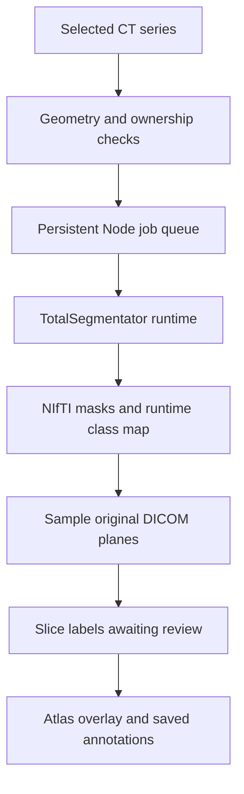

# Anatomy pipeline

## Upload and viewing

The browser sends multipart files to the Next.js Node route. Busboy streams uploads into a private temporary directory. ZIPs are read lazily with yauzl, and limits apply to both declared and actually expanded sizes. Files are parsed with dicom-parser; compressed pixel data takes the optional GDCM conversion path.

Study and series identifiers determine grouping. Orientation, dimensions, pixel spacing, image type, and temporal-position mismatches split stacks. Duplicate SOP instances are skipped within the import. A successful import atomically publishes each completed study directory; a failed import cleans temporary data.

Frames reference server-generated file/frame IDs, original SOP Instance UID, and zero-based frame number. The API sends already-rescaled float32 pixels. The browser applies the DICOM LINEAR window, photometric inversion, physical aspect ratio, pan, and zoom. It discards stale asynchronous pixel responses and only shows labels when the displayed pixel frame matches the selected frame.

## Model integration

The Node worker is a separate long-running process. Inference does not continue inside a request handler after returning a response. A disk lock prevents multiple workers against the same data root; startup marks interrupted running jobs as failed. Jobs carry workspace ownership. Shell execution is disabled, the region selects an allowlisted task list, and model paths come only from server configuration.

For each task, the worker requests a multilabel NIfTI volume. It reads the class map from the installed Python package, so a numeric class is never matched against a hardcoded mapping from another model version. Processing all tasks must succeed before new labels are persisted; existing manual/imported labels and reviewed model labels are retained.

## Geometry and labels

For DICOM pixel column `x` and row `y`, the physical location is:

`LPS = ImagePositionPatient + x × columnSpacing × rowDirection + y × rowSpacing × columnDirection`

The NIfTI query point is `inverseAffine × [-LPS.x, -LPS.y, LPS.z, 1]`. Sampling uses the full affine, including axis permutations, anisotropy, translation, and obliquity. Undefined spatial units or missing physical transforms are rejected. Neither filename order nor “slice 100 always contains structure X” determines a label.

Each original image plane is sampled into its own label grid. Structures occupying fewer than three source pixels are suppressed. A pointer is placed at the mask pixel closest to the structure's mean position; it cannot land in a hole merely because the centroid does. The point is saved in source pixel coordinates, with provenance and a review flag. Zooming and panning transform the point and image together.

The overlay prioritizes readable spacing on each side. Dense slices may show fewer overlay labels than the structure list. Category filters and the list let the user inspect remaining structures. Labels should be reviewed for segmentation error, mistaken anatomy, or poor anchor placement before use in teaching.

## Reference coverage

| Need from the reference                              | Implementation                                                                             |
| ---------------------------------------------------- | ------------------------------------------------------------------------------------------ |
| Axial CT stack and superior/inferior scrolling       | Physical ordering for geometry-complete axial stacks; source-plane orientation labels      |
| Globe, glands, head/neck vessels and several muscles | Optional installed head/neck segmentation tasks plus manual labels                         |
| A specific bony landmark or sinus substructure       | Manual labels when the installed task does not define that exact structure                 |
| Chest, abdomen, pelvis and other CT series           | Same viewer; major-structure model task on the selected series                             |
| Every structure on every uploaded patient            | Requires suitable trained models and reviewed validation data; not guaranteed by this app  |
| Labels moving through a volume                       | Per-frame model masks yield new anchors on each slice; manual labels remain frame-specific |
| Coronal/sagittal views synthesized from axial data   | Future MPR feature; current app displays acquired source planes                            |

To add a new model, introduce a server-controlled task/provider adapter that produces a spatially valid integer labelmap and a matching class map. Reuse the alignment tests and add anonymized reference studies with expert-verified masks. Do not reuse the screenshot's coordinates on unrelated patients.

## Deployment progression

The current implementation is a persistent single-server teaching workspace. A hospital deployment should replace browser-cookie ownership with verified identity and organization scopes, then add a transactional database and shared object store, a durable distributed job system, access logs, data lifecycle management, and validation of each model on intended scanners and protocols. Those integrations are outside this initial repository implementation.
